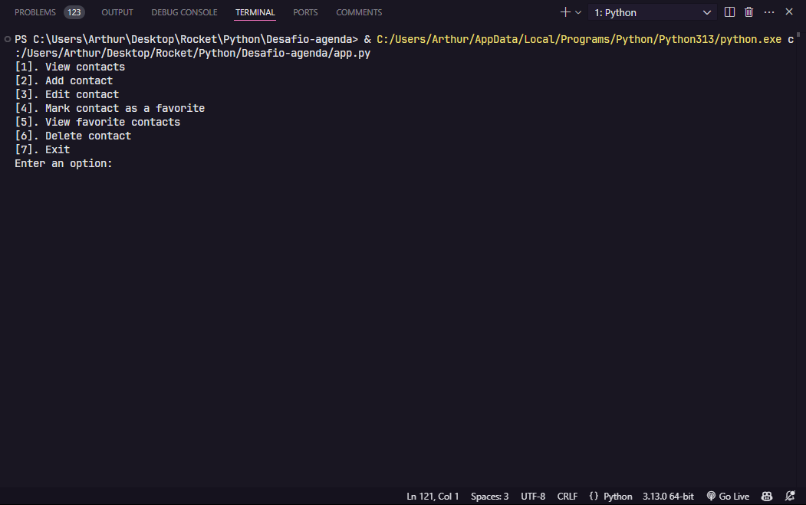

# Desafio agenda no Terminal Rocketseat

Um simulador de agenda no terminal. Um desafio da introdução do curso de Python da Rocketseat.

  <a href="#-tecnologias">Tecnologias</a>

 

  

## 🚀 Tecnologias

Esse projeto foi desenvolvido com as seguintes tecnologias:

- Python